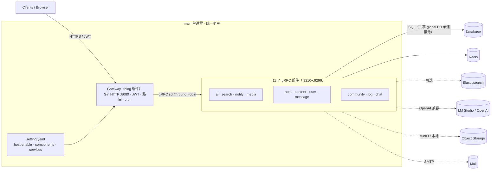
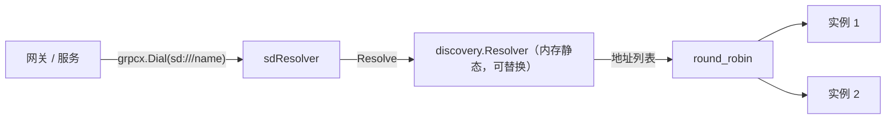
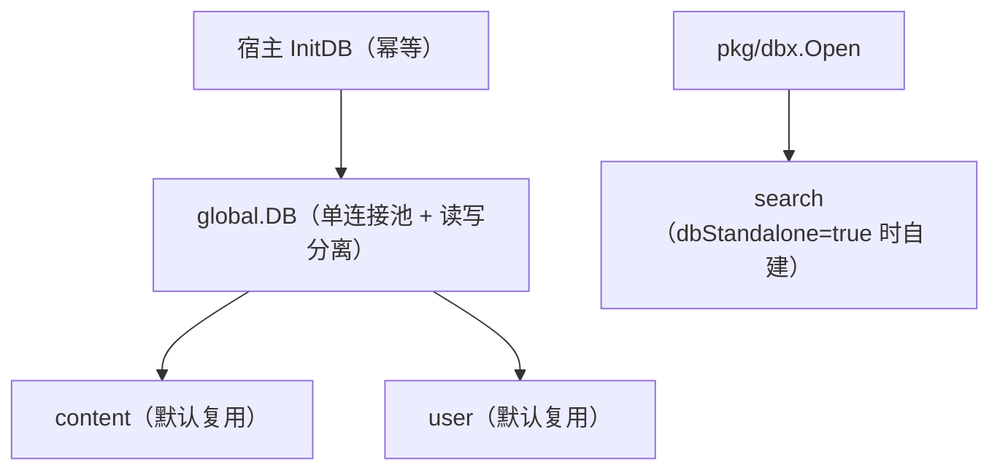
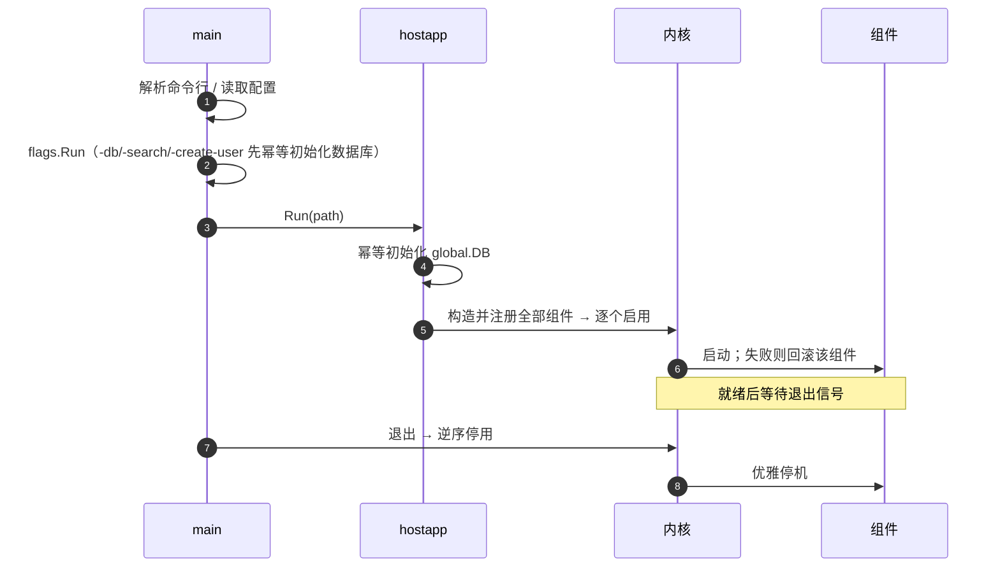

# GoBlog-StarDreamerCyberNook 架构设计

> 本文说明本项目的架构设计：一个进程即统一宿主，按 `setting.yaml` 装配「博客网关 + 11 个 gRPC 微服务组件」，共享数据库连接，支持组件级启停与独立部署。
>
> 阅读建议：先看 §1/§2 总览，再看 §4–§8 设计细节，§9/§10 讲容错与部署，§11 列已实现边界。

---

## 1. 概述

### 1.1 我们要解决的问题

项目最初是一个单体博客：`main.go` 里硬编码初始化 DB/Redis/ES/AI/存储，再一次性注册全部路由。这带来几个痛点：

- 想关掉某个能力（如 AI、ES、聊天）只能改代码重编译；
- 所有功能挤在一个进程的调用栈里，缺少清晰边界，一处出问题影响面不可控；
- 无法把同一份代码按需组合成不同职能，也无法把某块能力独立部署/扩容。

因此我们把系统重构为**统一宿主 + 组件化微服务**：`main` 是一个“外壳”，真正的功能以组件形式声明、装配和启停。

### 1.2 设计目标

- **可装配**：用配置（`setting.yaml`）决定启用哪些组件，缺省全部启用。
- **可分解**：每个组件是一个独立的 gRPC 服务，能独立部署为单独进程。
- **有边界**：组件通过服务键和 gRPC 交互，不直接依赖彼此代码。
- **可收敛**：启动有顺序、有依赖解析、失败可回滚；停止逆序优雅。
- **共享内核资源**：默认共享宿主的数据库连接等基础设施，避免重复建池。
- **可降级**：可选依赖关闭时，系统仍能运行（如 ES 关闭则走数据库检索）。

---

## 2. 总体架构



- **`main` 是宿主**：负责读取配置、装配并启停组件，本身不写业务。
- **`blog` 是网关组件**：提供 HTTP 服务、鉴权、路由、定时任务，并通过 gRPC 调用其他服务。
- **11 个微服务组件**：各自独立端口、独立职责，可同进程也可独立进程。

---

## 3. 目录与分层

| 层 | 目录 | 职责 |
|---|---|---|
| 内核 / 基础设施 | `pkg/` | `host`（组件内核适配）、`hostapp`（组合根）、`hostcfg`（配置派生）、`dbx`（数据库连接池）、`grpcx`（gRPC 拨号/拦截器）、`discovery`（服务发现）、`svc`（发现引导）、`blog`（博客运行时） |
| 组件层 | `services/*/component`、`services/*/internal` | 组件适配（对宿主）与业务实现（对 gRPC） |
| 独立入口 | `services/*/cmd` | 每个服务的独立进程入口 |
| 网关 | `api/`、`router/`、`middleware/` | HTTP 入口、路由、中间件 |
| 契约 / 生成 | `proto/`、`gen/` | protobuf 定义与生成代码 |
| 配置 | `conf/`、`setting.yaml` | 配置结构定义与单一配置源 |

依赖方向单一：`main → hostapp → host/hostcfg → 组件`，组件之间只通过服务键与 gRPC 交互，不互相 import。

---

## 4. 组件模型

### 4.1 组件契约

`pkg/host/host.go` 定义业务侧最小契约：

```go
type Component interface {
    Name() string                      // 唯一标识（服务键）
    Provides() []string                // 对外提供的能力
    Injects() []string                 // 依赖的其他组件（按组件名解析）
    Start(ctx context.Context) error   // 启动（监听端口 / 连接资源）
    Stop(ctx context.Context) error    // 停止（优雅停机）
}
```

工厂函数 `Factory func(config map[string]any) (Component, error)` 依据组件配置构造实例。

### 4.2 注册与装配

`pkg/host.Registry` 维护“组件名 → 规格（provides/injects/factory）”：

```go
reg.Register("content", []string{"content"}, nil, contentC.New)
```

`Registry.Run(ctx, blueprint)` 的流程：

1. **构造**：按蓝图对全部组件调用工厂，得到 `Component` 实例（不启动）；
2. **注册**：包装为内核插件注册；
3. **启用**：对“启用集”逐个 `Enable`，由内核按依赖关系解析装载顺序、失败回滚；
4. **等待退出**：收到信号或 `ctx` 结束后，**逆序** `Disable`，触发各组件 `Stop`。

> 目前 11 个组件均未声明 `Injects`，属于“平坦装配”，实际按启用顺序串行启动；后续可为 `content`、`user` 等声明依赖，让内核自动编排拓扑。

### 4.3 组件适配

`pkg/host/gn.go` 把 `Component` 适配为内核插件，使内核对「依赖解析、拓扑收敛、失败回滚、逆序卸载」负责，而组件只关心自身生命周期：

| 业务侧 | 内核钩子 | 语义 |
|---|---|---|
| `Injects()` | 依赖声明 | 装载顺序与回滚依据 |
| `Start(ctx)` | 装载钩子 | 产生副作用（监听/连库） |
| `Stop(ctx)` | 卸载钩子 | 回收副作用（停机） |
| `Name()` | 插件名 | 句柄 |

每个 gRPC 组件在 `Start` 中做两件事：`internal.NewServer(cfg)` 初始化业务实现，`net.Listen` + `grpcx.NewServer` 启动 gRPC 监听。

---

## 5. 装配与配置

### 5.1 单一配置源 `setting.yaml`

`setting.yaml` 同时承担“基础设施配置”和“装配清单”两件事：

```yaml
host:
  enable: true          # 是否以统一宿主运行（缺省 true）

services:               # 服务键 → 实例地址列表（网关按此拨号）
  content: ["127.0.0.1:9260"]
  user: ["127.0.0.1:9270"]
  # ...

components:             # 启用哪些组件（缺省=全部启用）
  blog: true
  content: true
  chat: false
  # 完整写法：开关 + 组件配置
  # content:
  #   enabled: true
  #   config:
  #     dbStandalone: true
  #     driver: mysql
  #     dsn: "user:pass@tcp(127.0.0.1:3306)/blog?charset=utf8mb4&parseTime=True&loc=Local"
```

`conf.ComponentConfig` 兼容两种写法：`chat: false`（简写布尔）与 `content: {enabled, config}`（完整）。未显式配置时全部启用；一旦显式配置，未列出的组件视为关闭。

### 5.2 组合根 `hostapp`

`pkg/hostapp` 是唯一“认识所有组件”的地方：

- `known`：列出 `host` + `blog` + 11 个服务；
- `Registry()`：登记全部组件工厂；
- `BlueprintFromConfig()`：把 `setting.yaml.components` 翻译为蓝图（`Enabled` + `Config`）；
- `Run(ctx, path)`：设置配置路径、读取配置、**幂等初始化共享数据库**，然后启动内核。

### 5.3 配置派生 `hostcfg`

`pkg/hostcfg` 把 `setting.yaml` 的字段派生为各组件的默认参数，避免每个组件重复读配置：

| 函数 | 作用 |
|---|---|
| `ServiceAddr(name, def)` | 取 `services.<name>` 首个地址 |
| `DBDialect()` | 从 `dbWrite[0]` 派生数据库驱动与 DSN |
| `JWT()` / `ES()` / `AI()` / `Email()` / `Media()` | 派生各域默认参数 |
| `OrStr/OrInt/OrFloat` | 非空/非零回退 |

组件在 `New(cfg)` 中优先取组件配置（`utils.Str/Int/Float/Bool`），缺省回退到 `hostcfg` 派生值。

---

## 6. 微服务与通信

### 6.1 服务清单

| 服务 | 端口 | 职责 |
|---|---|---|
| `ai` | 9210 | LLM 对话 / 审核 / 摘要 / 评级 |
| `search` | 9220 | Elasticsearch 检索 + 数据库回退 |
| `notify` | 9230 | SMTP 邮件 |
| `media` | 9240 | 图片元数据 / 对象存储 / 本地文件 |
| `auth` | 9250 | JWT 签发 / 刷新 |
| `content` | 9260 | 文章 / 评论 / 动态 / 收藏 / 浏览 |
| `user` | 9270 | 用户 / 关注 / 资料 / 登录日志 |
| `message` | 9280 | 站内信 / 通知 |
| `community` | 9290 | 反馈 / 轮播 / 友链 / 推广位 |
| `log` | 9295 | 系统日志 |
| `chat` | 9296 | 私信 / 会话 |

### 6.2 拨号与服务发现

网关与服务之间统一用 `pkg/grpcx.Dial("sd:///<service>")` 拨号：

- **自定义解析器**：`sd:///<service>` 经 `pkg/discovery.Resolver` 解析为实例地址列表；
- **负载均衡**：默认 `round_robin`；
- **发现来源**：`pkg/svc.Init` 进程级合并「内置默认 < `setting.yaml.services` < 环境变量 `SVC_<KEY>`」，写入内存静态注册表并注册解析器；
- **可替换**：`discovery.Resolver` 是接口，后续可接 etcd / Nacos / Consul，对调用方无感。



### 6.3 统一的调用元数据与防护

`pkg/grpcx` 的拦截器为每次调用注入/透传元数据，并做统一防护：

- **链路**：`trace-id` / `span-id` / `parent-span-id`；
- **超时**：把 `ctx` 的 deadline 写入元数据，服务端据此派生超时并校验；
- **防环**：调用深度自增，超过上限直接拒绝；
- **幂等**：`idempotency-key`；
- **兜底**：服务端 panic 恢复为错误，避免拖垮进程。

---

## 7. 数据访问设计

### 7.1 默认共享宿主数据库

- 宿主初始化**唯一**的 `global.DB`：连接池 `10/100/1h` + 读写分离；
- `core.InitDB` 是**幂等**的（已初始化则直接复用）；
- 带库的微服务默认**复用该句柄**（`Config.Standalone == false`），因此宿主模式下单进程只有 **1 套连接池**——避免多池争锁（SQLite 尤其明显），也保留宿主的池参数与读写分离。

### 7.2 可选独立库

当某服务需要独立数据库时，在组件配置中开启 `dbStandalone`：

```go
// services/*/internal NewServer
db := global.DB
if cfg.Standalone {
    db, err = dbx.Open(cfg.Driver, cfg.DSN) // 自建连接池
}
```

- 组件从 `components.<name>.config.dbStandalone` 读取开关（`utils.Bool`）；
- 独立进程入口 `services/*/cmd` 固定传 `Standalone: true`；
- `pkg/dbx.Open(driver, dsn)` 统一按 `mysql|postgres|sqlite` 打开并套用池参数。

### 7.3 通用查询与显式句柄

`common.ListQuery[T](db *gorm.DB, model, opts)` 的数据库句柄由调用方显式传入（各服务传各自的 db），不再全局硬编码，保证“共享/独立”两种模式下都取到正确的库。



---

## 8. 生命周期与启停

### 8.1 启动序列



### 8.2 关键设计点

- **构造与启动分离**：工厂只构造配置对象；真正的副作用（监听端口、连库、注册 Redis 缓存）发生在 `Start`；
- **失败回滚**：某组件启动失败，内核回收其已产生的副作用并清理，其余组件不受影响；
- **逆序停机**：退出时逆序停用，先启用的后关闭；
- **命令行附加功能前置**：`-db`（迁移）、`-search`（重建搜索表）、`-create-user`（建号）、`-es`、`-v` 在组件启动前于 `main` 统一执行；涉及数据库的先幂等初始化共享库。

---

## 9. 容错与降级

系统在设计上区分“必需”与“可选”，可选能力缺失时降级而非崩溃：

| 场景 | 行为 |
|---|---|
| Elasticsearch 不可用 / 关闭 | `search` 服务先尝试 ES，失败则**回退数据库检索表**（`searchDB`），检索能力不中断 |
| AI 关闭 / 不可用 | `components.ai: false` 或探活失败时，审核等流程**跳过 AI**，发文等主流程不阻塞 |
| 组件被禁用 | 蓝图置 `false` 即可整体下线该能力，其余组件照常 |
| 组件启动失败 | 内核回滚该组件，不影响其他组件 |
| 鉴权角色变更 / 封禁 | 角色缓存**即时失效**，下一个请求即生效，无需重启 |

> 说明：运行期的自动重启/健康探测（自愈）尚未实现，当前“故障不扩散”主要来自**加载期回滚**与**业务层降级**（如 ES→DB、AI 可选）。

---

## 10. 部署模式

同一份代码、同一套服务键，支持三种尺度：

| 模式 | 配置 | 说明 |
|---|---|---|
| **统一宿主**（默认） | `host.enable: true` | 全部组件在同一进程，网关经 gRPC 回环调用 |
| **仅博客 + 远程服务** | `host.enable: false`，`services` 指向远程 | 博客与微服务分进程部署 |
| **单服务独立部署** | 运行 `services/<svc>/cmd` | 每个服务是独立二进制/进程，`Standalone: true` 自建库 |

组件是否启用由 `setting.yaml.components` 决定，与部署模式正交：既可以在宿主里只启用部分组件，也可以把某些服务单独拉出去部署。

---

## 11. 已知边界与演进方向

**当前边界**

- 组件依赖图基本为空（平坦装配），尚未用依赖拓扑编排；
- 运行期无自动重启/健康探测/依赖撤回休眠等自愈能力；
- 组件 `Start/Stop` 未接入宿主 `context`（无法协作式取消/超时约束）；
- 同进程仍走 gRPC 回环（为统一部署尺度与负载均衡，属有意取舍）；
- `Provides()` 目前是声明，尚未驱动进程内服务目录。

**演进方向**

1. 为 `content/user/...` 声明 `Injects`，形成依赖拓扑与启停波次；
2. 引入健康探测与运行期自愈（重启/隔离）；
3. 组件生命周期接入 `context`，支持协作式取消与启动超时；
4. 依赖键版本化与静态可满足性检查（蓝图级校验）；
5. 视需要引入“进程内直调”快路径，降低同进程回环开销。

---

## 12. 附录

### 12.A 组件 / 端口 / 配置键

| 组件 | 端口 | 独立库键 | 备注 |
|---|---|---|---|
| `blog` | 8080 | — | 网关 + 定时任务 |
| `ai` | 9210 | — | LLM |
| `search` | 9220 | `dbStandalone` | ES 可选，DB 回退 |
| `notify` | 9230 | — | SMTP |
| `media` | 9240 | `dbStandalone` | 本地 / MinIO |
| `auth` | 9250 | — | JWT |
| `content` | 9260 | `dbStandalone` | 文章 / 评论 / 动态 |
| `user` | 9270 | `dbStandalone` | 用户 / 关注 |
| `message` | 9280 | `dbStandalone` | 站内信 |
| `community` | 9290 | `dbStandalone` | 反馈 / 轮播 / 友链 |
| `log` | 9295 | `dbStandalone` | 日志 |
| `chat` | 9296 | `dbStandalone` | 私信 |

### 12.B 关键代码索引

| 关注点 | 文件 |
|---|---|
| 组件契约 / 注册 / 启停 | `pkg/host/host.go`、`pkg/host/gn.go` |
| 组合根 / 蓝图生成 | `pkg/hostapp/hostapp.go` |
| 配置派生 | `pkg/hostcfg/hostcfg.go` |
| 博客运行时（HTTP + cron） | `pkg/blog/blog.go` |
| gRPC 拨号 / 拦截器 | `pkg/grpcx/grpcx.go`、`pkg/grpcx/interceptor.go`、`pkg/grpcx/meta.go` |
| 服务发现 | `pkg/discovery/discovery.go`、`pkg/svc/bootstrap.go` |
| 数据库连接池 | `pkg/dbx/dbx.go`、`core/init_DB.go` |
| 通用分页查询 | `common/list_query.go` |
| 组件配置类型 | `conf/enter.go`（`ComponentConfig`） |
| 组件实现示例 | `services/content/component/component.go`、`services/user/internal/server.go` |
| 独立进程入口 | `services/*/cmd/main.go` |
